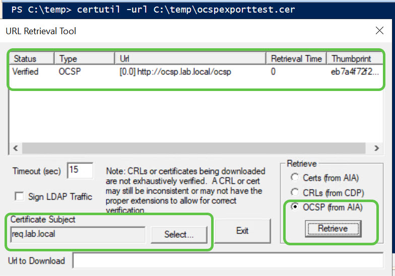

# OCSP Manual Configuration
## 🔧 Phase 1: Manual Prep (GUI Steps)


### 1. Duplicate the OCSP Template in Certification Authority GUI
```text   
Open Certification Authority on your issuing CA.
Right-click Certificate Templates → Manage.
Find the OCSP Response Signing template.
Right-click → Duplicate Template.
Give it a new name (e.g., Custom OCSP Signing).
Go to the Cryptography tab:
Set Provider Category to Key Storage Provider.
Set Key Length to 4096 bits.
Go to the Security tab:
Add both OCSP server computer accounts (OCSP1$, OCSP2$) with:
Read
Enroll
Autoenroll
Click OK to save.
```

### 2. Publish the New Template
```Text   
Back in Certification Authority, right-click Certificate Templates → New → Certificate Template to Issue.
Select your new custom OCSP template and click OK.
```

### 3. Create and Link GPO for Auto-Enrollment
```Text   
Open Group Policy Management.
Create a new GPO (e.g., OCSP AutoEnroll Policy) or edit an existing one.
Link it to the OU containing your OCSP servers.
Edit the GPO:
Navigate to:
Computer Configuration
  → Policies
    → Windows Settings
      → Security Settings
        → Public Key Policies
          → Certificate Services Client - Auto-Enrollment
Set Configuration Model to Enabled.
Check:
✅ Renew expired certificates...
✅ Update certificates that use certificate templates...
✅ Enroll certificates automatically...
```

### 4. Force Group Policy Update on OCSP Servers
```text
On each OCSP server (as Admin):
```
```powershell
gpupdate /force
```

### 5. Verify OCSP Certificates Are Present
On each OCSP server:

```powershell
Get-ChildItem Cert:\LocalMachine\My |fl
```

### Install the OCSP Role with via the Server Manager GUI

### Validate OCSP functionality
```text
In a browser go to https://req.lab.local/certsrv
Select the Certificate for the url and export it
Copy it to the OCSP server and run certuil -URL to use the validation tool
Select the exported cert
select OCSP and validate
```
   
  
  
  