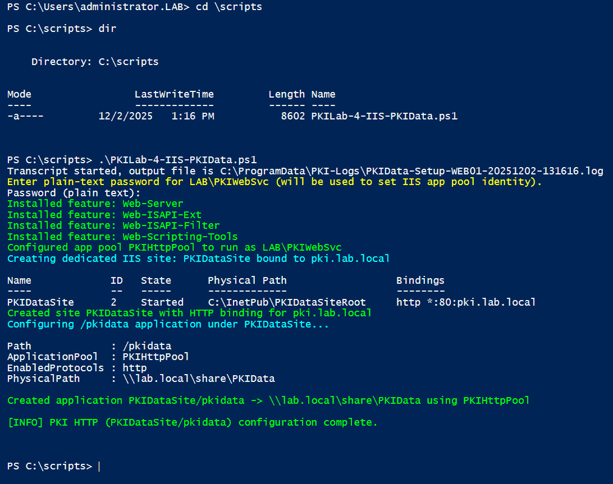
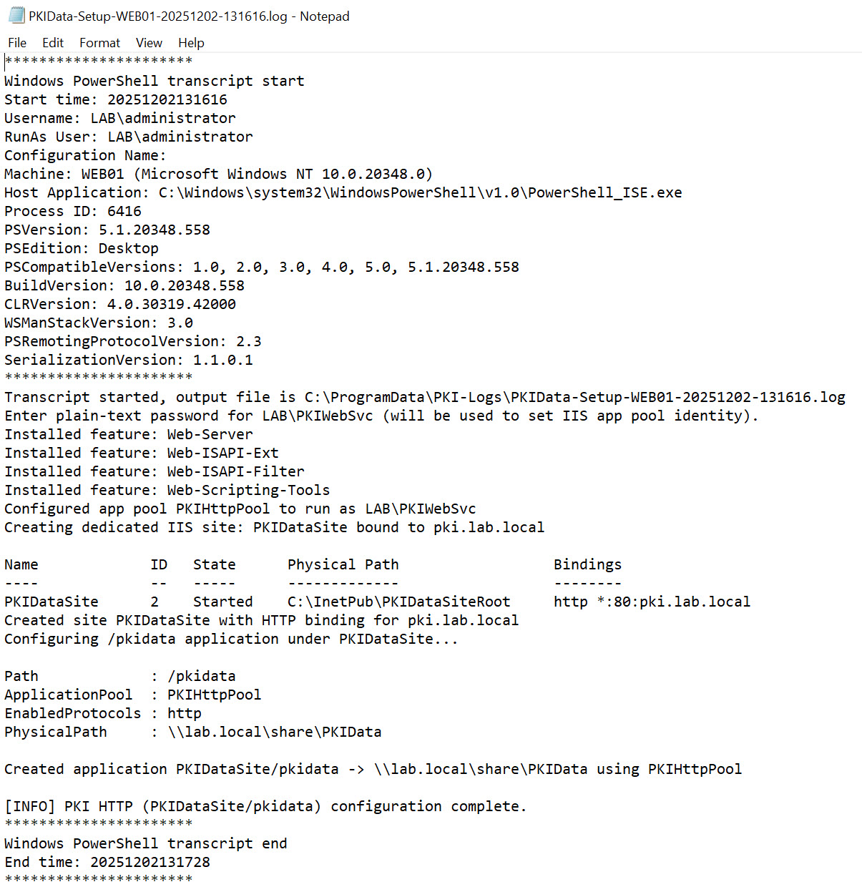
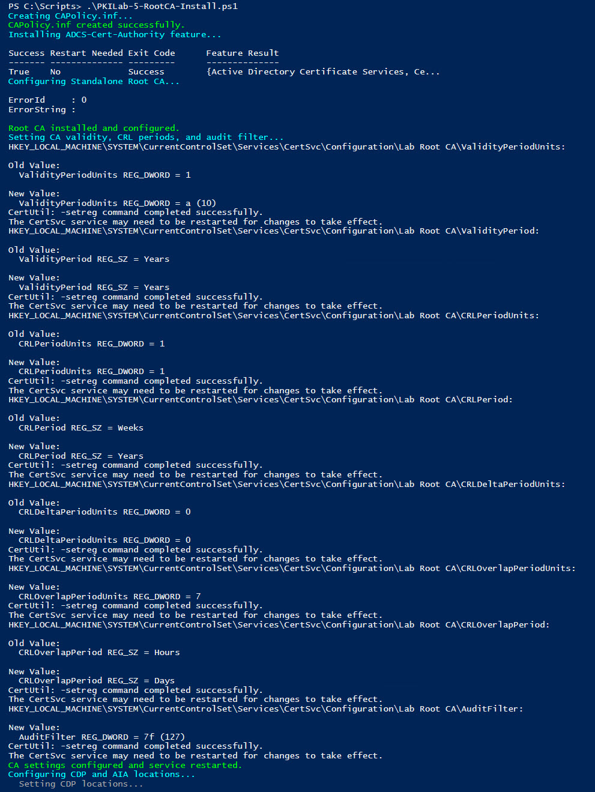
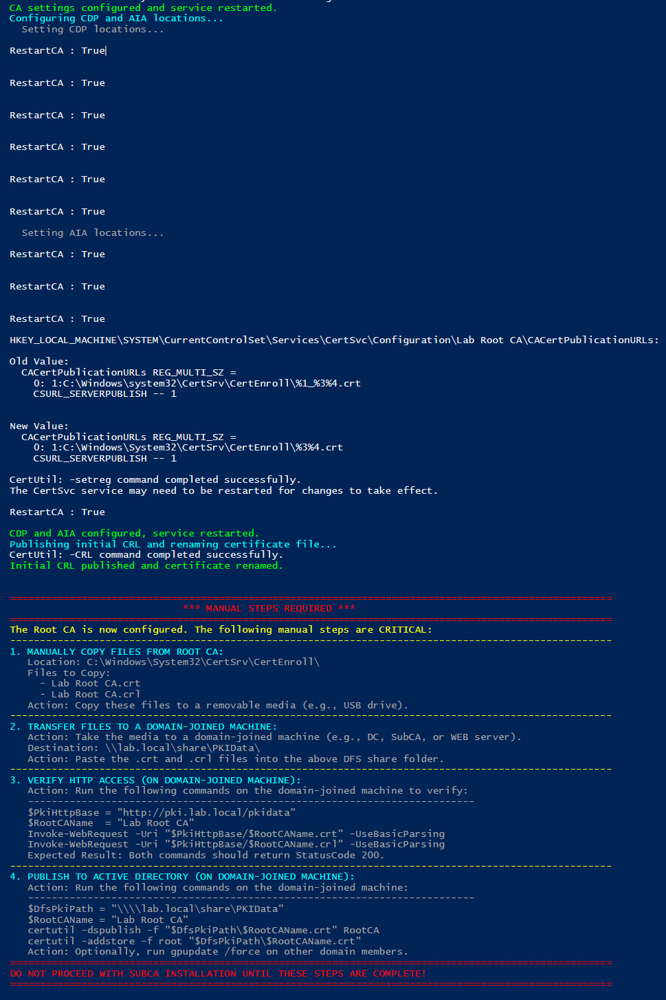

# PKI Deployment Instructions

## 1 Domain Controller

### 1.1 SPN and Service Account

```powershell
<#
.SYNOPSIS
  Create/update PKI web service account, register SPNs, configure Resource-Based Constrained Delegation (RBCD)
  on target CA computers, and validate the ACLs.

.NOTES
  - Run elevated on a Domain Controller or an RSAT host with ActiveDirectory module.
  - Requires appropriate AD permissions: creating users/groups requires delegated rights; RBCD changes require Enterprise Admin or equivalent.
  - Edit $SvcSam, $GroupName, $HostNames, and $TargetComputers to match your environment before running.
#>

Import-Module ActiveDirectory -ErrorAction Stop

# -------------------------
# Configuration - edit these
# -------------------------
$SvcSam         = "PKIWebSvc"                # sAMAccountName for service account
$GroupName      = "PKI Web Servers"          # Group to contain web servers (optional)
$HostNames      = @("pki","req")             # Hostname(s) used by the service (short names)
$TargetComputers = @("subca1","subca2")      # CA computer names for RBCD (sAMAccountName)
# -------------------------

# Derive domain information
$adDomain = Get-ADDomain -ErrorAction Stop
$DomainDns = $adDomain.DNSRoot                # e.g. lab.local
$DomainNetBios = $adDomain.NetBIOSName        # e.g. LAB

Write-Host ( "Domain DNS: {0}   NetBIOS: {1}" -f $DomainDns, $DomainNetBios ) -ForegroundColor Cyan

# Prompt for password (secure)
$pwd = Read-Host -Prompt ( "Enter password for {0}\{1} (secure input)" -f $DomainNetBios, $SvcSam ) -AsSecureString

# -------------------------
# Create or update service account
# -------------------------
$existing = Get-ADUser -Filter "SamAccountName -eq '$SvcSam'" -ErrorAction SilentlyContinue

if (-not $existing) {
    Write-Host ( "Creating service account: {0}\{1}" -f $DomainNetBios, $SvcSam ) -ForegroundColor Green

    $display = "$SvcSam Service Account"
    $upn = "{0}@{1}" -f $SvcSam, $DomainDns

    New-ADUser -Name $display `
        -GivenName $SvcSam `
        -Surname "Service Account" `
        -DisplayName $display `
        -SamAccountName $SvcSam `
        -UserPrincipalName $upn `
        -AccountPassword $pwd `
        -Enabled $true `
        -PasswordNeverExpires $false `
        -Description "Service account for PKI Web Enrollment / ReqSite"

    Write-Host ( "Created: {0} (UPN: {1})" -f $display, $upn ) -ForegroundColor Green
} else {
    Write-Host ( "Service account {0} exists. Updating display/UPN fields." -f $SvcSam ) -ForegroundColor Yellow
    $display = "$SvcSam Service Account"
    $upn = "{0}@{1}" -f $SvcSam, $DomainDns

    Set-ADUser -Identity $SvcSam `
        -GivenName $SvcSam `
        -Surname "Service Account" `
        -DisplayName $display `
        -UserPrincipalName $upn `
        -Description "Service account for PKI Web Enrollment / ReqSite"

    Write-Host ( "Updated: {0} (UPN: {1})" -f $display, $upn ) -ForegroundColor Green
}

# -------------------------
# Create group and add membership
# -------------------------
if (-not (Get-ADGroup -Filter "Name -eq '$GroupName'" -ErrorAction SilentlyContinue)) {
    New-ADGroup -Name $GroupName -GroupScope Global -GroupCategory Security -Description "Group for PKI web servers"
    Write-Host ( "Created group: {0}" -f $GroupName ) -ForegroundColor Green
} else {
    Write-Host ( "Group {0} already exists." -f $GroupName ) -ForegroundColor Yellow
}

# Add service account to group (idempotent)
try {
    Add-ADGroupMember -Identity $GroupName -Members $SvcSam -ErrorAction Stop
    Write-Host ( "Added {0} to {1}" -f $SvcSam, $GroupName ) -ForegroundColor Green
} catch {
    $msg = $_.Exception.Message
    if ($msg -match "Some or all of the specified accounts are already members") {
        Write-Host ( "{0} already a member of {1}" -f $SvcSam, $GroupName ) -ForegroundColor Gray
    } else {
        Write-Warning ( "Could not add {0} to {1}: {2}" -f $SvcSam, $GroupName, $msg )
    }
}

# -------------------------
# Register SPNs
# -------------------------
# Build SPN list using hostnames (short + FQDN)
$spns = @()
foreach ($h in $HostNames) {
    $spns += "HTTP/$h.$DomainDns"
    $spns += "HTTP/$h"
}

Write-Host "`nChecking for duplicate SPNs in domain..." -ForegroundColor Cyan
try {
    & setspn -X 2>&1 | ForEach-Object { Write-Host $_ }
} catch {
    Write-Warning ( "setspn -X failed or not available in this environment: {0}" -f $_.Exception.Message )
}

# Register SPNs to the service account (use -S to avoid duplicates)
foreach ($spn in $spns) {
    Write-Host ( "Registering SPN: {0} -> {1}\{2}" -f $spn, $DomainNetBios, $SvcSam )
    try {
        & setspn -S $spn "$DomainNetBios\$SvcSam" 2>&1 | ForEach-Object { Write-Host $_ }
    } catch {
        Write-Warning ( "Failed to register SPN {0}: {1}" -f $spn, $_.Exception.Message )
    }
}

# -------------------------
# Configure Resource-Based Constrained Delegation (RBCD)
# -------------------------
Write-Host ( "" )  # newline separator
Write-Host ( "🚀 Configuring RBCD: {0}\{1} → {2}" -f $DomainNetBios, $SvcSam, ($TargetComputers -join ', ') ) -ForegroundColor Cyan

# RBCD GUID for msDS-AllowedToActOnBehalfOfOtherIdentity extended right
$RBCD_GUID = [guid]"cc05a6da-1a38-433b-b09c-9f4d07f55eaa"

# Build trustee NTAccount
$trusteeName = "$DomainNetBios\$SvcSam"
$trustee = [System.Security.Principal.NTAccount]$trusteeName

foreach ($computer in $TargetComputers) {
    Write-Host ( "`n📋 Processing {0}..." -f $computer ) -ForegroundColor Green
    try {
        $target = Get-ADComputer -Identity $computer -ErrorAction Stop

        # Create ACE granting ExtendedRight for RBCD
        $ace = New-Object System.DirectoryServices.ActiveDirectoryAccessRule(
            $trustee,
            [System.DirectoryServices.ActiveDirectoryRights]"ExtendedRight",
            [System.Security.AccessControl.AccessControlType]::Allow,
            $RBCD_GUID
        )

        # Apply ACE onto computer object's ACL
        $adPath = "AD:$($target.DistinguishedName)"
        $acl = Get-Acl -Path $adPath
        $acl.AddAccessRule($ace)
        Set-Acl -Path $adPath -AclObject $acl

        Write-Host ( "  ✅ RBCD GRANTED: {0} → {1}" -f $trusteeName, $computer ) -ForegroundColor Green
    } catch {
        Write-Host ( "  ❌ FAILED {0}: {1}" -f $computer, $_.Exception.Message ) -ForegroundColor Red
    }
}

Write-Host ( "" )
Write-Host ( "🎉 RBCD CONFIGURATION COMPLETE!" ) -ForegroundColor Green
Write-Host ( "⏳ Replication: Allow time for AD replication if present." ) -ForegroundColor Yellow

# -------------------------
# Validate RBCD
# -------------------------
Write-Host ( "" )
Write-Host ( "🔍 RBCD VALIDATION REPORT" ) -ForegroundColor Cyan
$AllGood = $true

foreach ($computer in $TargetComputers) {
    try {
        $target = Get-ADComputer -Identity $computer -Properties DistinguishedName -ErrorAction Stop
        $adPath = "AD:$($target.DistinguishedName)"
        $acl = Get-Acl -Path $adPath

        $rbcdAce = $acl.Access | Where-Object {
            $_.ObjectType -eq $RBCD_GUID -and ($_.IdentityReference -like "*$SvcSam*" -or $_.IdentityReference -like "*$DomainNetBios*")
        }

        Write-Host ( "{0} :" -f $computer ) -NoNewline -ForegroundColor Cyan

        if ($rbcdAce) {
            Write-Host " ✅ VALID RBCD ACE" -ForegroundColor Green
            foreach ($ace in $rbcdAce) {
                Write-Host ( "  👤 User: {0}" -f $ace.IdentityReference ) -ForegroundColor White
                Write-Host ( "  ⚡ Right: {0}" -f $ace.ActiveDirectoryRights ) -ForegroundColor White
                Write-Host ( "  🔑 GUID: {0}" -f $ace.ObjectType ) -ForegroundColor Gray
            }
        } else {
            Write-Host " ❌ RBCD ACE MISSING!" -ForegroundColor Red
            $AllGood = $false
        }
    } catch {
        Write-Host ( "{0} : ❌ ERROR - {1}" -f $computer, $_.Exception.Message ) -ForegroundColor Red
        $AllGood = $false
    }
    Write-Host ""
}

# Final summary
Write-Host ( "📊 VALIDATION SUMMARY:" ) -ForegroundColor Yellow
if ($AllGood) {
    Write-Host ( "  🎉 ALL RBCD ACES VALIDATED SUCCESSFULLY!" ) -ForegroundColor Green
    Write-Host ( "  ✅ {0}\{1} can delegate to all target CAs" -f $DomainNetBios, $SvcSam ) -ForegroundColor Green
} else {
    Write-Host ( "  ⚠️  SOME RBCD ACES MISSING - Review output above and re-run configuration as needed." ) -ForegroundColor Red
}

Write-Host ( "" )
Write-Host ( "✅ EXPECTED STATE:" ) -ForegroundColor Gray
Write-Host ( "   • PKIWebSvc Delegation tab: 'Do not trust' (on PKIWebSvc account)" ) -ForegroundColor Gray
Write-Host ( "   • CA Servers Delegation tab: 'Do not trust' (on CA server objects)" ) -ForegroundColor Gray
Write-Host ( "   • RBCD ACE: Present in CA computer object's nTSecurityDescriptor only" ) -ForegroundColor Gray

# End of script
```

### 1.2 Script Output

 

## 2 File Server

### 2.1 PKIData Share and permissions
## Run this script on File1.lab.local and File2.lab.local
```powershell
<#
.SYNOPSIS
  Configures the PKIData share on a target file server.
  - Creates C:\PKIData if missing.
  - Creates SMB share 'PKIData' if missing.
  - Grants SMB and NTFS permissions to specified CA, web, OCSP machine accounts,
    and the PKIWebSvc service account.

.PARAMETER TargetServer
  The hostname (short name or FQDN) of the file server to configure.
  Defaults to the local computer's hostname if not specified.

.NOTES
  - Run elevated on the target file server or remotely with appropriate permissions.
  - Edit hostnames in the Configuration section if your environment differs.
#>

[CmdletBinding()]
param(
    [string]$TargetServer = $env:COMPUTERNAME
)

# -------------------------
# Configuration (edit if needed)
# -------------------------
$DomainFqdn       = "lab.local"
$DomainNetBios    = "LAB"
$PkiFolderName    = "PKIData" # This will also be the name of the SMB share

# Server hostnames used by share ACLs (FQDN)
# These are the *machine accounts* that need access to the share.
$SubCA1           = "subca1.lab.local"
$SubCA2           = "subca2.lab.local"
$WebServer1       = "web01.lab.local"
$WebServer2       = "web02.lab.local"
$OcspServer1      = "ocsp1.lab.local"
$OcspServer2      = "ocsp2.lab.local"

# Service account (must exist in AD)
$PkiWebSvcAccount = "PKIWebSvc"

# Derived path (auto-calculated)
# Using Join-Path for robust path construction
$LocalPkiFolder   = Join-Path -Path "C:\" -ChildPath $PkiFolderName
# -------------------------


Write-Host ( "Starting PKI share configuration on: {0}" -f $TargetServer ) -ForegroundColor Cyan
Write-Host ( "Local folder: {0}" -f $LocalPkiFolder ) -ForegroundColor Cyan
Write-Host ( "Share name: {0}" -f $PkiFolderName ) -ForegroundColor Cyan # Use $PkiFolderName directly

# 1) Create the local folder if missing
Write-Host ( "Checking for local folder: {0}" -f $LocalPkiFolder ) -ForegroundColor DarkGray
if (-not (Test-Path -Path $LocalPkiFolder)) {
    Write-Host ( "Creating folder: {0}" -f $LocalPkiFolder ) -ForegroundColor Green
    New-Item -Path $LocalPkiFolder -ItemType Directory -Force | Out-Null
} else {
    Write-Host ( "Folder already exists: {0}" -f $LocalPkiFolder ) -ForegroundColor Gray
}

# 2) Create SMB share if missing
Write-Host ( "Checking for SMB share: {0}" -f $PkiFolderName ) -ForegroundColor DarkGray # Use $PkiFolderName directly
if (-not (Get-SmbShare -Name $PkiFolderName -ErrorAction SilentlyContinue)) { # Use $PkiFolderName directly
    Write-Host ( "Creating SMB share '{0}' -> {1}" -f $PkiFolderName, $LocalPkiFolder ) -ForegroundColor Green # Use $PkiFolderName directly
    New-SmbShare -Name $PkiFolderName -Path $LocalPkiFolder -FullAccess "Administrators","SYSTEM" -ErrorAction Stop # Use $PkiFolderName directly
} else {
    Write-Host ( "SMB share '{0}' already exists." -f $PkiFolderName ) -ForegroundColor Gray # Use $PkiFolderName directly
}

# 3) Extract short hostnames (machine account names) for ACLs
$SubCA1Short  = ($SubCA1 -split '\.')[0]
$SubCA2Short  = ($SubCA2 -split '\.')[0]
$Web1Short    = ($WebServer1 -split '\.')[0]
$Web2Short    = ($WebServer2 -split '\.')[0]
$Ocsp1Short   = ($OcspServer1 -split '\.')[0]
$Ocsp2Short   = ($OcspServer2 -split '\.')[0]

# Define all accounts that need access
$accountsForShareAccess = @(
    "$DomainNetBios\$SubCA1Short`$",
    "$DomainNetBios\$SubCA2Short`$",
    "$DomainNetBios\$Web1Short`$",
    "$DomainNetBios\$Web2Short`$",
    "$DomainNetBios\$Ocsp1Short`$",
    "$DomainNetBios\$Ocsp2Short`$",
    "$DomainNetBios\$PkiWebSvcAccount"
)

# 4) Grant SMB share access
Write-Host ( "Granting SMB share access to required accounts..." ) -ForegroundColor Cyan
foreach ($account in $accountsForShareAccess) {
    $accessRight = "Read"
    if ($account -like "*$SubCA1Short`$*" -or $account -like "*$SubCA2Short`$*") {
        $accessRight = "Change" # CAs need Change for publishing
    }
    Write-Host ( "  Granting '{0}' access to '{1}' on share '{2}'" -f $accessRight, $account, $PkiFolderName ) -ForegroundColor DarkGray # Use $PkiFolderName directly
    Grant-SmbShareAccess -Name $PkiFolderName -AccountName $account -AccessRight $accessRight -Force -ErrorAction SilentlyContinue # Use $PkiFolderName directly
}

# 5) NTFS Permissions
Write-Host ( "Applying NTFS permissions on {0}..." -f $LocalPkiFolder ) -ForegroundColor Cyan

# Base permissions for SYSTEM and Administrators
icacls $LocalPkiFolder /grant "SYSTEM:(OI)(CI)F" /grant "Administrators:(OI)(CI)F" /T | Out-Null

# Permissions for machine accounts and service account
$accountsForNtfs = @(
    @{ Name = "$DomainNetBios\$SubCA1Short`$"; Rights = "(OI)(CI)M" }, # CAs need Modify
    @{ Name = "$DomainNetBios\$SubCA2Short`$"; Rights = "(OI)(CI)M" },
    @{ Name = "$DomainNetBios\$Web1Short`$"; Rights = "(OI)(CI)RX" }, # Web servers need Read/Execute
    @{ Name = "$DomainNetBios\$Web2Short`$"; Rights = "(OI)(CI)RX" },
    @{ Name = "$DomainNetBios\$Ocsp1Short`$"; Rights = "(OI)(CI)RX" }, # OCSP servers need Read/Execute
    @{ Name = "$DomainNetBios\$Ocsp2Short`$"; Rights = "(OI)(CI)RX" },
    @{ Name = "${DomainNetBios}\${PkiWebSvcAccount}"; Rights = "(OI)(CI)RX" } # PKIWebSvc needs Read/Execute
)

foreach ($aclEntry in $accountsForNtfs) {
    Write-Host ( "  Granting '{0}' to '{1}' on folder '{2}'" -f $aclEntry.Rights, $aclEntry.Name, $LocalPkiFolder ) -ForegroundColor DarkGray
    icacls $LocalPkiFolder /grant "$($aclEntry.Name):$($aclEntry.Rights)" /T | Out-Null
}

# --- New Section: Display Final Share Permissions ---
Write-Host "`nSMB Share Permissions for '$PkiFolderName':" -ForegroundColor Cyan
Get-SmbShareAccess -Name $PkiFolderName |
    Select-Object AccountName, AccessRight, AccessControlType |
    Format-Table -AutoSize

Write-Host ( "PKI share configuration complete on {0}!" -f $TargetServer ) -ForegroundColor Green
```

 

## 3 DFS

### 3.1 DFS configuration

```text
DFS will be installed via Server Manager GUI on both File servers
The configuration is represented in the following diagrams
```

    

    

    

    

    

    

    
```

## 4 Web Server
### 4.1 pki.lab.local/pkidata

```text
This script will configure a dedicated IIS site for use with pki.lab.local/pkidata
```


```powershell
<#
.SYNOPSIS
  Configures a dedicated IIS site for PKI HTTP (/pkidata) publishing (CDP/AIA).
  - Creates a new IIS site bound to pki.lab.local.
  - Creates /pkidata application under this site, pointing to the DFS share.
  - Configures application pool, authentication, and MIME types.
  - Plain-text password prompt for LAB\PKIWebSvc (temporary).
  - Run elevated. Use -Verbose. Logs to %ProgramData%\PKI-Logs.
#>

param()

# Ensure elevated
if (-not ([Security.Principal.WindowsPrincipal][Security.Principal.WindowsIdentity]::GetCurrent()).IsInRole([Security.Principal.WindowsBuiltInRole]::Administrator)) {
    Write-Error "Run this script elevated (Run as Administrator)." ; exit 1
}

# Start transcript/log
$logDir = Join-Path $env:ProgramData "PKI-Logs"
if (-not (Test-Path $logDir)) { New-Item -Path $logDir -ItemType Directory -Force | Out-Null }
$timestamp = (Get-Date).ToString('yyyyMMdd-HHmmss')
$logFile = Join-Path $logDir "PKIData-Setup-${env:COMPUTERNAME}-${timestamp}.log"
Start-Transcript -Path $logFile -Force
Write-Verbose "Transcript started: ${logFile}"

# CONFIG
$DomainNetBios    = "LAB"
$DfsRoot          = "\\lab.local\share"
$PkiFolderName    = "PKIData"
$DfsPkiPath       = Join-Path $DfsRoot $PkiFolderName
$PkiHttpHost      = "pki.lab.local"
$PKIHttpPool      = "PKIHttpPool"
$PkiWebSvcAccount = "PKIWebSvc"
$serviceAccount   = "${DomainNetBios}\${PkiWebSvcAccount}"

# New site specific variables
$PKIDataSiteName  = "PKIDataSite"
$PKIDataSiteRoot  = "C:\InetPub\PKIDataSiteRoot" # Placeholder physical path for the site root

# Prompt for plain-text password (temporary plaintext)
Write-Host "Enter plain-text password for ${serviceAccount} (will be used to set IIS app pool identity)." -ForegroundColor Yellow
$passwordPlain = Read-Host -Prompt "Password (plain text)"

# Required features
$requiredFeatures = @(
    "Web-Server",
    "Web-Static-Content",
    "Web-Default-Doc",
    "Web-ISAPI-Ext",
    "Web-ISAPI-Filter",
    "Web-Scripting-Tools"
)

foreach ($feature in $requiredFeatures) {
    try {
        $status = Get-WindowsFeature -Name $feature -ErrorAction Stop
        if (-not $status.Installed) {
            Write-Verbose "Installing feature: ${feature}"
            Install-WindowsFeature -Name $feature -IncludeManagementTools -ErrorAction Stop | Out-Null
            Write-Host "Installed feature: ${feature}" -ForegroundColor Green
        } else {
            Write-Verbose "Feature already installed: ${feature}"
        }
    } catch {
        Write-Warning "Could not query/install feature ${feature}: $($_.Exception.Message)"
    }
}

# Import IIS module
Import-Module WebAdministration -ErrorAction Stop

try {
    # 1) Create PKIHttpPool and set identity
    if (-not (Test-Path "IIS:\AppPools\${PKIHttpPool}")) {
        New-WebAppPool -Name $PKIHttpPool | Out-Null
        Write-Verbose "Created app pool ${PKIHttpPool}"
    }
    Set-ItemProperty "IIS:\AppPools\${PKIHttpPool}" -Name processModel.identityType -Value 3
    Set-ItemProperty "IIS:\AppPools\${PKIHttpPool}" -Name processModel.userName -Value $serviceAccount
    Set-ItemProperty "IIS:\AppPools\${PKIHttpPool}" -Name processModel.password -Value $passwordPlain
    Restart-WebAppPool $PKIHttpPool
    Write-Host "Configured app pool ${PKIHttpPool} to run as ${serviceAccount}" -ForegroundColor Green

    # 2) Create PKIDataSite
    Write-Host "Creating dedicated IIS site: ${PKIDataSiteName} bound to ${PkiHttpHost}" -ForegroundColor Cyan
    if (-not (Test-Path $PKIDataSiteRoot)) { New-Item -Path $PKIDataSiteRoot -ItemType Directory -Force | Out-Null; Write-Verbose "Created ${PKIDataSiteRoot}" }

    $pkiDataSite = Get-Website -Name $PKIDataSiteName -ErrorAction SilentlyContinue
    if (-not $pkiDataSite) {
        New-Website -Name $PKIDataSiteName -Port 80 -HostHeader $PkiHttpHost -PhysicalPath $PKIDataSiteRoot -ApplicationPool $PKIHttpPool
        Write-Host "Created site ${PKIDataSiteName} with HTTP binding for ${PkiHttpHost}" -ForegroundColor Green
    } else {
        Write-Verbose "Site ${PKIDataSiteName} already exists."
        # Ensure the site is using the correct app pool
        Set-ItemProperty "IIS:\Sites\${PKIDataSiteName}" -Name applicationPool -Value $PKIHttpPool
        Write-Verbose "Set application pool for ${PKIDataSiteName} to ${PKIHttpPool}"
        # Ensure HTTP binding exists
        if (-not (Get-WebBinding -Name $PKIDataSiteName -Protocol http -HostHeader $PkiHttpHost -ErrorAction SilentlyContinue)) {
            New-WebBinding -Name $PKIDataSiteName -Protocol http -Port 80 -HostHeader $PkiHttpHost
            Write-Host "Added HTTP binding for ${PkiHttpHost} to ${PKIDataSiteName}" -ForegroundColor Green
        }
    }
    Start-Website $PKIDataSiteName

    # 3) Create /pkidata application under the new site, pointing to DFS
    Write-Host "Configuring /pkidata application under ${PKIDataSiteName}..." -ForegroundColor Cyan
    if (-not (Test-Path $DfsPkiPath)) {
        Write-Warning "DFS path ${DfsPkiPath} not reachable. Check network/permissions for ${serviceAccount}."
    }

    $pkiApp = Get-WebApplication -Site $PKIDataSiteName -Name "pkidata" -ErrorAction SilentlyContinue
    if (-not $pkiApp) {
        New-WebApplication -Site $PKIDataSiteName -Name "pkidata" -PhysicalPath $DfsPkiPath -ApplicationPool $PKIHttpPool
        Write-Host "Created application ${PKIDataSiteName}/pkidata -> ${DfsPkiPath} using ${PKIHttpPool}" -ForegroundColor Green
    } else {
        Set-WebApplication -Site $PKIDataSiteName -Name "pkidata" -PhysicalPath $DfsPkiPath -ApplicationPool $PKIHttpPool
        Write-Verbose "Ensured application ${PKIDataSiteName}/pkidata uses ${PKIHttpPool} and points to ${DfsPkiPath}"
    }

    # 4) Configure authentication and directory browsing for /pkidata (anonymous enabled)
    # These settings are now applied specifically to the /pkidata application under PKIDataSite
    Set-WebConfiguration -Filter /system.webServer/security/authentication/anonymousAuthentication -PSPath "MACHINE/WEBROOT/APPHOST" -Metadata overrideMode -Value Allow -ErrorAction SilentlyContinue
    Set-WebConfiguration -Filter /system.webServer/security/authentication/windowsAuthentication -PSPath "MACHINE/WEBROOT/APPHOST" -Metadata overrideMode -Value Allow -ErrorAction SilentlyContinue

    Set-WebConfigurationProperty -PSPath "IIS:\Sites\${PKIDataSiteName}\pkidata" -Filter /system.webServer/security/authentication/anonymousAuthentication -Name enabled -Value $true
    Set-WebConfigurationProperty -PSPath "IIS:\Sites\${PKIDataSiteName}\pkidata" -Filter /system.webServer/security/authentication/anonymousAuthentication -Name userName -Value ""
    Set-WebConfigurationProperty -PSPath "IIS:\Sites\${PKIDataSiteName}\pkidata" -Filter /system.webServer/security/authentication/windowsAuthentication -Name enabled -Value $false

    Set-WebConfigurationProperty -PSPath "IIS:\Sites\${PKIDataSiteName}\pkidata" -Filter /system.webServer/directoryBrowse -Name enabled -Value $true
    Set-WebConfigurationProperty -PSPath "IIS:\Sites\${PKIDataSiteName}" -Filter /system.webServer/security/requestFiltering -Name allowDoubleEscaping -Value $true # Apply to the site

    # 5) Ensure mime types for crl/crt
    function Ensure-MimeType {
        param([string]$Extension,[string]$MimeType)
        $existing = Get-WebConfigurationProperty -pspath 'IIS:\' -filter 'system.webServer/staticContent/mimeMap' -name '.' |
            Where-Object { $_.fileExtension -eq $Extension }
        if (-not $existing) {
            Add-WebConfigurationProperty -pspath 'IIS:\' -filter 'system.webServer/staticContent' -name '.' -value @{ fileExtension = $Extension; mimeType = $MimeType }
            Write-Verbose "Added mime type ${Extension} -> ${MimeType}"
        } else {
            Write-Verbose "Mime type for ${Extension} already exists"
        }
    }
    Ensure-MimeType -Extension '.crl' -MimeType 'application/pkix-crl'
    Ensure-MimeType -Extension '.crt' -MimeType 'application/x-x509-ca-cert'

    # Restart relevant pools and IIS to ensure changes take effect
    Restart-WebAppPool $PKIHttpPool
    Write-Host "`n[INFO] PKI HTTP (${PKIDataSiteName}/pkidata) configuration complete." -ForegroundColor Green

} catch {
    Write-Error "Error configuring PKI HTTP: $($_.Exception.Message)"
    throw
} finally {
    # Clear plaintext password variable from memory (best-effort)
    $passwordPlain = $null
    Stop-Transcript | Out-Null
}
```

### 4.2 pki.lab.local/pkidata Output

    

    


## 5 Root CA
### 5.1 Rooot CA initial Install

```powershell

### RUN THIS ENTIRE SCRIPT ON THE OFFLINE ROOT CA SERVER (elevated PowerShell)
### This script configures the CA and generates the cert/CRL.
### Manual steps are required afterward to move files and publish to AD.

### 1 - Common Variables
$DomainFqdn    = "lab.local"
$PkiHttpHost   = "pki.lab.local"
$RootCAName    = "Lab Root CA"

# Derived
$PkiHttpBase   = "http://$PkiHttpHost/pkidata"
$CertEnrollDir = "C:\Windows\System32\CertSrv\CertEnroll"

### 2 - Create CAPolicy.inf
Write-Host "Creating CAPolicy.inf..." -ForegroundColor Cyan
$caPolicyContent = @"
[Version]
Signature=`$Windows NT`$

[PolicyStatementExtension]
Policies=InternalPolicy

[InternalPolicy]
OID=1.2.3.4.1455.67.89.5
Notice="Legal Policy Statement"
URL=$PkiHttpBase/cps.html

[Certsrv_Server]
RenewalKeyLength=4096
RenewalValidityPeriod=Years
RenewalValidityPeriodUnits=20
LoadDefaultTemplates=0
AlternateSignatureAlgorithm=0
"@
Set-Content -Path C:\Windows\CAPolicy.inf -Value $caPolicyContent -Force
Write-Host "CAPolicy.inf created successfully." -ForegroundColor Green

### 3 - Install AD CS Role and Configure Root CA
Write-Host "Installing ADCS-Cert-Authority feature..." -ForegroundColor Cyan
Install-WindowsFeature ADCS-Cert-Authority -IncludeManagementTools

Write-Host "Configuring Standalone Root CA..." -ForegroundColor Cyan
$vCaRootProperties = @{
  CACommonName              = $RootCAName
  CADistinguishedNameSuffix = 'O=Lab,L=Fort Lauderdale,S=Florida,C=US'
  CAType                    = 'StandaloneRootCA'
  CryptoProviderName        = 'RSA#Microsoft Software Key Storage Provider'
  HashAlgorithmName         = 'SHA256'
  KeyLength                 = 4096
  ValidityPeriod            = 'Years'
  ValidityPeriodUnits       = 20
}
Install-AdcsCertificationAuthority @vCaRootProperties -Force
Write-Host "Root CA installed and configured." -ForegroundColor Green

### 4 - Configure Validity and CRL Settings
Write-Host "Setting CA validity, CRL periods, and audit filter..." -ForegroundColor Cyan
certutil -setreg CA\ValidityPeriodUnits 10
certutil -setreg CA\ValidityPeriod "Years"
certutil -setreg CA\CRLPeriodUnits 1
certutil -setreg CA\CRLPeriod "Years"
certutil -setreg CA\CRLDeltaPeriodUnits 0
certutil -setreg CA\CRLOverlapPeriodUnits 7
certutil -setreg CA\CRLOverlapPeriod "Days"
certutil -setreg CA\AuditFilter 127
Restart-Service certsvc
Write-Host "CA settings configured and service restarted." -ForegroundColor Green

### 5 - Configure CDP and AIA locations
Write-Host "Configuring CDP and AIA locations..." -ForegroundColor Cyan
Import-Module ADCSAdministration

# ---- CDP (CRL Distribution Points) ----
Write-Host "  Setting CDP locations..." -ForegroundColor Gray
$crllist = Get-CACrlDistributionPoint
foreach ($crl in $crllist) { Remove-CACrlDistributionPoint $crl.Uri -Force }
Add-CACRLDistributionPoint -Uri "$CertEnrollDir\%3%8.crl" -PublishToServer -PublishDeltaToServer -Force
Add-CACRLDistributionPoint -Uri "$PkiHttpBase/%3%8.crl" -AddToCertificateCDP -AddToFreshestCrl -Force

# ---- AIA (Authority Information Access) ----
Write-Host "  Setting AIA locations..." -ForegroundColor Gray
Get-CAAuthorityInformationAccess | Where-Object { $_.Uri -like '*ldap*' -or $_.Uri -like '*http*' -or $_.Uri -like '*file*' -or $_.Uri -like '\\*' } | Remove-CAAuthorityInformationAccess -Force
certutil -setreg CA\CACertPublicationURLs "1:$CertEnrollDir\%3%4.crt"
Add-CAAuthorityInformationAccess -Uri "$PkiHttpBase/%3%4.crt" -AddToCertificateAia -Force

Restart-Service certsvc
Write-Host "CDP and AIA configured, service restarted." -ForegroundColor Green

### 6 - Finalize and Prepare for Manual Steps
Write-Host "Publishing initial CRL and renaming certificate file..." -ForegroundColor Cyan
certutil -CRL
Start-Sleep -Seconds 2
Rename-Item "$CertEnrollDir\caroot1_$RootCAName.crt" "$CertEnrollDir\$RootCAName.crt" -Force
Write-Host "Initial CRL published and certificate renamed." -ForegroundColor Green

# --- MANUAL STEPS FOR OFFLINE ROOT ---
Write-Host "`n`n=====================================================================================================" -ForegroundColor Red
Write-Host "                             *** MANUAL STEPS REQUIRED ***" -ForegroundColor Red
Write-Host "=====================================================================================================" -ForegroundColor Red
Write-Host "The Root CA is now configured. The following manual steps are CRITICAL:" -ForegroundColor Yellow
Write-Host "-----------------------------------------------------------------------------------------------------" -ForegroundColor Yellow
Write-Host "1. MANUALLY COPY FILES FROM ROOT CA:" -ForegroundColor Cyan
Write-Host "   Location: C:\Windows\System32\CertSrv\CertEnroll\" -ForegroundColor Gray
Write-Host "   Files to Copy:" -ForegroundColor Gray
Write-Host "     - ${RootCAName}.crt" -ForegroundColor Gray
Write-Host "     - ${RootCAName}.crl" -ForegroundColor Gray
Write-Host "   Action: Copy these files to a removable media (e.g., USB drive)." -ForegroundColor Gray
Write-Host "-----------------------------------------------------------------------------------------------------" -ForegroundColor Yellow
Write-Host "2. TRANSFER FILES TO A DOMAIN-JOINED MACHINE:" -ForegroundColor Cyan
Write-Host "   Action: Take the media to a domain-joined machine (e.g., DC, SubCA, or WEB server)." -ForegroundColor Gray
Write-Host "   Destination: \\${DomainFqdn}\share\PKIData\" -ForegroundColor Gray
Write-Host "   Action: Paste the .crt and .crl files into the above DFS share folder." -ForegroundColor Gray
Write-Host "-----------------------------------------------------------------------------------------------------" -ForegroundColor Yellow
Write-Host "3. VERIFY HTTP ACCESS (ON DOMAIN-JOINED MACHINE):" -ForegroundColor Cyan
Write-Host "   Action: Run the following commands on the domain-joined machine to verify:" -ForegroundColor Gray
Write-Host "   ---------------------------------------------------------------------------" -ForegroundColor Gray
Write-Host "   `$PkiHttpBase = `"http://${PkiHttpHost}/pkidata`"" -ForegroundColor Gray
Write-Host "   `$RootCAName  = `"${RootCAName}`"" -ForegroundColor Gray
Write-Host "   Invoke-WebRequest -Uri `"`$PkiHttpBase/`$RootCAName.crt`" -UseBasicParsing" -ForegroundColor Gray
Write-Host "   Invoke-WebRequest -Uri `"`$PkiHttpBase/`$RootCAName.crl`" -UseBasicParsing" -ForegroundColor Gray
Write-Host "   Expected Result: Both commands should return StatusCode 200." -ForegroundColor Gray
Write-Host "-----------------------------------------------------------------------------------------------------" -ForegroundColor Yellow
Write-Host "4. PUBLISH TO ACTIVE DIRECTORY (ON DOMAIN-JOINED MACHINE):" -ForegroundColor Cyan
Write-Host "   Action: Run the following commands on the domain-joined machine:" -ForegroundColor Gray
Write-Host "   ---------------------------------------------------------------------------" -ForegroundColor Gray
Write-Host "   `$DfsPkiPath = `"\\\\${DomainFqdn}\share\PKIData`"" -ForegroundColor Gray
Write-Host "   `$RootCAName = `"${RootCAName}`"" -ForegroundColor Gray
Write-Host "   certutil -dspublish -f `"`$DfsPkiPath\`$RootCAName.crt`" RootCA" -ForegroundColor Gray
Write-Host "   certutil -addstore -f root `"`$DfsPkiPath\`$RootCAName.crt`"" -ForegroundColor Gray
Write-Host "   Action: Optionally, run `gpupdate /force` on other domain members." -ForegroundColor Gray
Write-Host "=====================================================================================================" -ForegroundColor Red
Write-Host "DO NOT PROCEED WITH SUBCA INSTALLATION UNTIL THESE STEPS ARE COMPLETE!" -ForegroundColor Red
Write-Host "=====================================================================================================" -ForegroundColor Red

# Open folder for easy access to files needing manual copy
explorer.exe $CertEnrollDir
```

### 5.2 Root CA Initial Install Output

    

    
