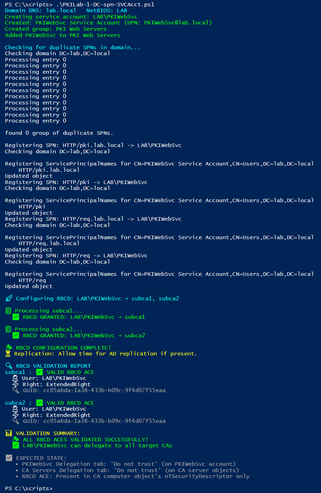
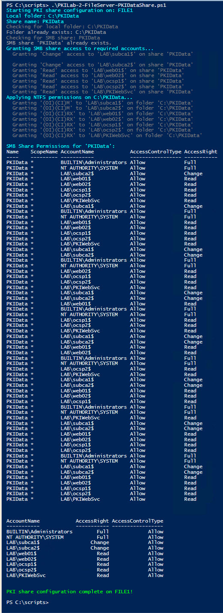
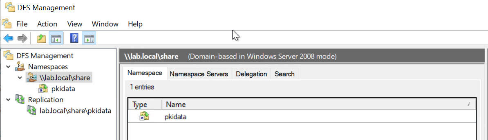
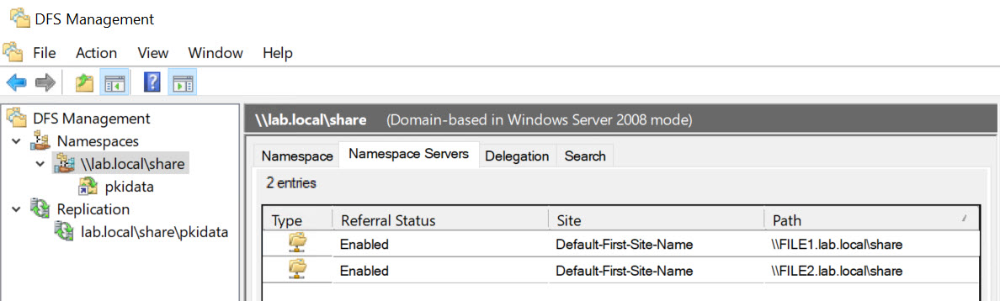
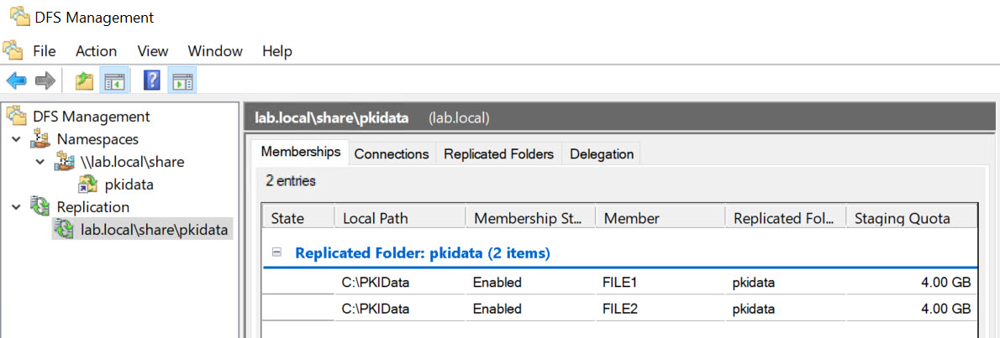

# PKI Deployment Instructions

## 1 Domain Controller

### 1.1 SPN and Service Account

```powershell
<#
.SYNOPSIS
  Create/update PKI web service account, register SPNs, configure Resource-Based Constrained Delegation (RBCD)
  on target CA computers, and validate the ACLs.

.NOTES
  - Run elevated on a Domain Controller or an RSAT host with ActiveDirectory module.
  - Requires appropriate AD permissions: creating users/groups requires delegated rights; RBCD changes require Enterprise Admin or equivalent.
  - Edit $SvcSam, $GroupName, $HostNames, and $TargetComputers to match your environment before running.
#>

Import-Module ActiveDirectory -ErrorAction Stop

# -------------------------
# Configuration - edit these
# -------------------------
$SvcSam         = "PKIWebSvc"                # sAMAccountName for service account
$GroupName      = "PKI Web Servers"          # Group to contain web servers (optional)
$HostNames      = @("pki","req")             # Hostname(s) used by the service (short names)
$TargetComputers = @("subca1","subca2")      # CA computer names for RBCD (sAMAccountName)
# -------------------------

# Derive domain information
$adDomain = Get-ADDomain -ErrorAction Stop
$DomainDns = $adDomain.DNSRoot                # e.g. lab.local
$DomainNetBios = $adDomain.NetBIOSName        # e.g. LAB

Write-Host ( "Domain DNS: {0}   NetBIOS: {1}" -f $DomainDns, $DomainNetBios ) -ForegroundColor Cyan

# Prompt for password (secure)
$pwd = Read-Host -Prompt ( "Enter password for {0}\{1} (secure input)" -f $DomainNetBios, $SvcSam ) -AsSecureString

# -------------------------
# Create or update service account
# -------------------------
$existing = Get-ADUser -Filter "SamAccountName -eq '$SvcSam'" -ErrorAction SilentlyContinue

if (-not $existing) {
    Write-Host ( "Creating service account: {0}\{1}" -f $DomainNetBios, $SvcSam ) -ForegroundColor Green

    $display = "$SvcSam Service Account"
    $upn = "{0}@{1}" -f $SvcSam, $DomainDns

    New-ADUser -Name $display `
        -GivenName $SvcSam `
        -Surname "Service Account" `
        -DisplayName $display `
        -SamAccountName $SvcSam `
        -UserPrincipalName $upn `
        -AccountPassword $pwd `
        -Enabled $true `
        -PasswordNeverExpires $false `
        -Description "Service account for PKI Web Enrollment / ReqSite"

    Write-Host ( "Created: {0} (UPN: {1})" -f $display, $upn ) -ForegroundColor Green
} else {
    Write-Host ( "Service account {0} exists. Updating display/UPN fields." -f $SvcSam ) -ForegroundColor Yellow
    $display = "$SvcSam Service Account"
    $upn = "{0}@{1}" -f $SvcSam, $DomainDns

    Set-ADUser -Identity $SvcSam `
        -GivenName $SvcSam `
        -Surname "Service Account" `
        -DisplayName $display `
        -UserPrincipalName $upn `
        -Description "Service account for PKI Web Enrollment / ReqSite"

    Write-Host ( "Updated: {0} (UPN: {1})" -f $display, $upn ) -ForegroundColor Green
}

# -------------------------
# Create group and add membership
# -------------------------
if (-not (Get-ADGroup -Filter "Name -eq '$GroupName'" -ErrorAction SilentlyContinue)) {
    New-ADGroup -Name $GroupName -GroupScope Global -GroupCategory Security -Description "Group for PKI web servers"
    Write-Host ( "Created group: {0}" -f $GroupName ) -ForegroundColor Green
} else {
    Write-Host ( "Group {0} already exists." -f $GroupName ) -ForegroundColor Yellow
}

# Add service account to group (idempotent)
try {
    Add-ADGroupMember -Identity $GroupName -Members $SvcSam -ErrorAction Stop
    Write-Host ( "Added {0} to {1}" -f $SvcSam, $GroupName ) -ForegroundColor Green
} catch {
    $msg = $_.Exception.Message
    if ($msg -match "Some or all of the specified accounts are already members") {
        Write-Host ( "{0} already a member of {1}" -f $SvcSam, $GroupName ) -ForegroundColor Gray
    } else {
        Write-Warning ( "Could not add {0} to {1}: {2}" -f $SvcSam, $GroupName, $msg )
    }
}

# -------------------------
# Register SPNs
# -------------------------
# Build SPN list using hostnames (short + FQDN)
$spns = @()
foreach ($h in $HostNames) {
    $spns += "HTTP/$h.$DomainDns"
    $spns += "HTTP/$h"
}

Write-Host "`nChecking for duplicate SPNs in domain..." -ForegroundColor Cyan
try {
    & setspn -X 2>&1 | ForEach-Object { Write-Host $_ }
} catch {
    Write-Warning ( "setspn -X failed or not available in this environment: {0}" -f $_.Exception.Message )
}

# Register SPNs to the service account (use -S to avoid duplicates)
foreach ($spn in $spns) {
    Write-Host ( "Registering SPN: {0} -> {1}\{2}" -f $spn, $DomainNetBios, $SvcSam )
    try {
        & setspn -S $spn "$DomainNetBios\$SvcSam" 2>&1 | ForEach-Object { Write-Host $_ }
    } catch {
        Write-Warning ( "Failed to register SPN {0}: {1}" -f $spn, $_.Exception.Message )
    }
}

# -------------------------
# Configure Resource-Based Constrained Delegation (RBCD)
# -------------------------
Write-Host ( "" )  # newline separator
Write-Host ( "🚀 Configuring RBCD: {0}\{1} → {2}" -f $DomainNetBios, $SvcSam, ($TargetComputers -join ', ') ) -ForegroundColor Cyan

# RBCD GUID for msDS-AllowedToActOnBehalfOfOtherIdentity extended right
$RBCD_GUID = [guid]"cc05a6da-1a38-433b-b09c-9f4d07f55eaa"

# Build trustee NTAccount
$trusteeName = "$DomainNetBios\$SvcSam"
$trustee = [System.Security.Principal.NTAccount]$trusteeName

foreach ($computer in $TargetComputers) {
    Write-Host ( "`n📋 Processing {0}..." -f $computer ) -ForegroundColor Green
    try {
        $target = Get-ADComputer -Identity $computer -ErrorAction Stop

        # Create ACE granting ExtendedRight for RBCD
        $ace = New-Object System.DirectoryServices.ActiveDirectoryAccessRule(
            $trustee,
            [System.DirectoryServices.ActiveDirectoryRights]"ExtendedRight",
            [System.Security.AccessControl.AccessControlType]::Allow,
            $RBCD_GUID
        )

        # Apply ACE onto computer object's ACL
        $adPath = "AD:$($target.DistinguishedName)"
        $acl = Get-Acl -Path $adPath
        $acl.AddAccessRule($ace)
        Set-Acl -Path $adPath -AclObject $acl

        Write-Host ( "  ✅ RBCD GRANTED: {0} → {1}" -f $trusteeName, $computer ) -ForegroundColor Green
    } catch {
        Write-Host ( "  ❌ FAILED {0}: {1}" -f $computer, $_.Exception.Message ) -ForegroundColor Red
    }
}

Write-Host ( "" )
Write-Host ( "🎉 RBCD CONFIGURATION COMPLETE!" ) -ForegroundColor Green
Write-Host ( "⏳ Replication: Allow time for AD replication if present." ) -ForegroundColor Yellow

# -------------------------
# Validate RBCD
# -------------------------
Write-Host ( "" )
Write-Host ( "🔍 RBCD VALIDATION REPORT" ) -ForegroundColor Cyan
$AllGood = $true

foreach ($computer in $TargetComputers) {
    try {
        $target = Get-ADComputer -Identity $computer -Properties DistinguishedName -ErrorAction Stop
        $adPath = "AD:$($target.DistinguishedName)"
        $acl = Get-Acl -Path $adPath

        $rbcdAce = $acl.Access | Where-Object {
            $_.ObjectType -eq $RBCD_GUID -and ($_.IdentityReference -like "*$SvcSam*" -or $_.IdentityReference -like "*$DomainNetBios*")
        }

        Write-Host ( "{0} :" -f $computer ) -NoNewline -ForegroundColor Cyan

        if ($rbcdAce) {
            Write-Host " ✅ VALID RBCD ACE" -ForegroundColor Green
            foreach ($ace in $rbcdAce) {
                Write-Host ( "  👤 User: {0}" -f $ace.IdentityReference ) -ForegroundColor White
                Write-Host ( "  ⚡ Right: {0}" -f $ace.ActiveDirectoryRights ) -ForegroundColor White
                Write-Host ( "  🔑 GUID: {0}" -f $ace.ObjectType ) -ForegroundColor Gray
            }
        } else {
            Write-Host " ❌ RBCD ACE MISSING!" -ForegroundColor Red
            $AllGood = $false
        }
    } catch {
        Write-Host ( "{0} : ❌ ERROR - {1}" -f $computer, $_.Exception.Message ) -ForegroundColor Red
        $AllGood = $false
    }
    Write-Host ""
}

# Final summary
Write-Host ( "📊 VALIDATION SUMMARY:" ) -ForegroundColor Yellow
if ($AllGood) {
    Write-Host ( "  🎉 ALL RBCD ACES VALIDATED SUCCESSFULLY!" ) -ForegroundColor Green
    Write-Host ( "  ✅ {0}\{1} can delegate to all target CAs" -f $DomainNetBios, $SvcSam ) -ForegroundColor Green
} else {
    Write-Host ( "  ⚠️  SOME RBCD ACES MISSING - Review output above and re-run configuration as needed." ) -ForegroundColor Red
}

Write-Host ( "" )
Write-Host ( "✅ EXPECTED STATE:" ) -ForegroundColor Gray
Write-Host ( "   • PKIWebSvc Delegation tab: 'Do not trust' (on PKIWebSvc account)" ) -ForegroundColor Gray
Write-Host ( "   • CA Servers Delegation tab: 'Do not trust' (on CA server objects)" ) -ForegroundColor Gray
Write-Host ( "   • RBCD ACE: Present in CA computer object's nTSecurityDescriptor only" ) -ForegroundColor Gray

# End of script
```

### 1.2 Script Output

 

## 2 File Server

### 2.1 PKIData Share and permissions
## Run this script on File1.lab.local and File2.lab.local
```powershell
<#
.SYNOPSIS
  Configures the PKIData share on a target file server.
  - Creates C:\PKIData if missing.
  - Creates SMB share 'PKIData' if missing.
  - Grants SMB and NTFS permissions to specified CA, web, OCSP machine accounts,
    and the PKIWebSvc service account.

.PARAMETER TargetServer
  The hostname (short name or FQDN) of the file server to configure.
  Defaults to the local computer's hostname if not specified.

.NOTES
  - Run elevated on the target file server or remotely with appropriate permissions.
  - Edit hostnames in the Configuration section if your environment differs.
#>

[CmdletBinding()]
param(
    [string]$TargetServer = $env:COMPUTERNAME
)

# -------------------------
# Configuration (edit if needed)
# -------------------------
$DomainFqdn       = "lab.local"
$DomainNetBios    = "LAB"
$PkiFolderName    = "PKIData" # This will also be the name of the SMB share

# Server hostnames used by share ACLs (FQDN)
# These are the *machine accounts* that need access to the share.
$SubCA1           = "subca1.lab.local"
$SubCA2           = "subca2.lab.local"
$WebServer1       = "web01.lab.local"
$WebServer2       = "web02.lab.local"
$OcspServer1      = "ocsp1.lab.local"
$OcspServer2      = "ocsp2.lab.local"

# Service account (must exist in AD)
$PkiWebSvcAccount = "PKIWebSvc"

# Derived path (auto-calculated)
# Using Join-Path for robust path construction
$LocalPkiFolder   = Join-Path -Path "C:\" -ChildPath $PkiFolderName
# -------------------------


Write-Host ( "Starting PKI share configuration on: {0}" -f $TargetServer ) -ForegroundColor Cyan
Write-Host ( "Local folder: {0}" -f $LocalPkiFolder ) -ForegroundColor Cyan
Write-Host ( "Share name: {0}" -f $PkiFolderName ) -ForegroundColor Cyan # Use $PkiFolderName directly

# 1) Create the local folder if missing
Write-Host ( "Checking for local folder: {0}" -f $LocalPkiFolder ) -ForegroundColor DarkGray
if (-not (Test-Path -Path $LocalPkiFolder)) {
    Write-Host ( "Creating folder: {0}" -f $LocalPkiFolder ) -ForegroundColor Green
    New-Item -Path $LocalPkiFolder -ItemType Directory -Force | Out-Null
} else {
    Write-Host ( "Folder already exists: {0}" -f $LocalPkiFolder ) -ForegroundColor Gray
}

# 2) Create SMB share if missing
Write-Host ( "Checking for SMB share: {0}" -f $PkiFolderName ) -ForegroundColor DarkGray # Use $PkiFolderName directly
if (-not (Get-SmbShare -Name $PkiFolderName -ErrorAction SilentlyContinue)) { # Use $PkiFolderName directly
    Write-Host ( "Creating SMB share '{0}' -> {1}" -f $PkiFolderName, $LocalPkiFolder ) -ForegroundColor Green # Use $PkiFolderName directly
    New-SmbShare -Name $PkiFolderName -Path $LocalPkiFolder -FullAccess "Administrators","SYSTEM" -ErrorAction Stop # Use $PkiFolderName directly
} else {
    Write-Host ( "SMB share '{0}' already exists." -f $PkiFolderName ) -ForegroundColor Gray # Use $PkiFolderName directly
}

# 3) Extract short hostnames (machine account names) for ACLs
$SubCA1Short  = ($SubCA1 -split '\.')[0]
$SubCA2Short  = ($SubCA2 -split '\.')[0]
$Web1Short    = ($WebServer1 -split '\.')[0]
$Web2Short    = ($WebServer2 -split '\.')[0]
$Ocsp1Short   = ($OcspServer1 -split '\.')[0]
$Ocsp2Short   = ($OcspServer2 -split '\.')[0]

# Define all accounts that need access
$accountsForShareAccess = @(
    "$DomainNetBios\$SubCA1Short`$",
    "$DomainNetBios\$SubCA2Short`$",
    "$DomainNetBios\$Web1Short`$",
    "$DomainNetBios\$Web2Short`$",
    "$DomainNetBios\$Ocsp1Short`$",
    "$DomainNetBios\$Ocsp2Short`$",
    "$DomainNetBios\$PkiWebSvcAccount"
)

# 4) Grant SMB share access
Write-Host ( "Granting SMB share access to required accounts..." ) -ForegroundColor Cyan
foreach ($account in $accountsForShareAccess) {
    $accessRight = "Read"
    if ($account -like "*$SubCA1Short`$*" -or $account -like "*$SubCA2Short`$*") {
        $accessRight = "Change" # CAs need Change for publishing
    }
    Write-Host ( "  Granting '{0}' access to '{1}' on share '{2}'" -f $accessRight, $account, $PkiFolderName ) -ForegroundColor DarkGray # Use $PkiFolderName directly
    Grant-SmbShareAccess -Name $PkiFolderName -AccountName $account -AccessRight $accessRight -Force -ErrorAction SilentlyContinue # Use $PkiFolderName directly
}

# 5) NTFS Permissions
Write-Host ( "Applying NTFS permissions on {0}..." -f $LocalPkiFolder ) -ForegroundColor Cyan

# Base permissions for SYSTEM and Administrators
icacls $LocalPkiFolder /grant "SYSTEM:(OI)(CI)F" /grant "Administrators:(OI)(CI)F" /T | Out-Null

# Permissions for machine accounts and service account
$accountsForNtfs = @(
    @{ Name = "$DomainNetBios\$SubCA1Short`$"; Rights = "(OI)(CI)M" }, # CAs need Modify
    @{ Name = "$DomainNetBios\$SubCA2Short`$"; Rights = "(OI)(CI)M" },
    @{ Name = "$DomainNetBios\$Web1Short`$"; Rights = "(OI)(CI)RX" }, # Web servers need Read/Execute
    @{ Name = "$DomainNetBios\$Web2Short`$"; Rights = "(OI)(CI)RX" },
    @{ Name = "$DomainNetBios\$Ocsp1Short`$"; Rights = "(OI)(CI)RX" }, # OCSP servers need Read/Execute
    @{ Name = "$DomainNetBios\$Ocsp2Short`$"; Rights = "(OI)(CI)RX" },
    @{ Name = "${DomainNetBios}\${PkiWebSvcAccount}"; Rights = "(OI)(CI)RX" } # PKIWebSvc needs Read/Execute
)

foreach ($aclEntry in $accountsForNtfs) {
    Write-Host ( "  Granting '{0}' to '{1}' on folder '{2}'" -f $aclEntry.Rights, $aclEntry.Name, $LocalPkiFolder ) -ForegroundColor DarkGray
    icacls $LocalPkiFolder /grant "$($aclEntry.Name):$($aclEntry.Rights)" /T | Out-Null
}

# --- New Section: Display Final Share Permissions ---
Write-Host "`nSMB Share Permissions for '$PkiFolderName':" -ForegroundColor Cyan
Get-SmbShareAccess -Name $PkiFolderName |
    Select-Object AccountName, AccessRight, AccessControlType |
    Format-Table -AutoSize

Write-Host ( "PKI share configuration complete on {0}!" -f $TargetServer ) -ForegroundColor Green
```

 

## 3 DFS

### 3.1 DFS configuration

```text
DFS will be installed via Server Manager GUI on both File servers
The configuration is represented in the following diagrams
```

    

    

    

    

    

    

    


