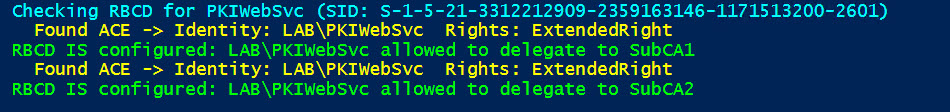

# Why Resource-Based Constrained Delegation is secure and recommended

```test
Using Resource-Based Constrained Delegation (RBCD) configured so that the service account (PKIWebSvc) is explicitly allowed to delegate to the CA computers is considered secure and best practice for several reasons:
```

### 1 Why RBCD with explicit ACLs on target computers is secure and recommended:   

#### 1.1 Least Privilege Delegation:
```text   
RBCD lets the resource (the CA computers) control exactly which accounts can delegate to it.
This avoids granting broad delegation rights on the service account or domain-wide, reducing attack surface.   
No Need for Domain-Wide Delegation Rights:
Unlike traditional constrained delegation, RBCD does not require delegation rights to be granted on the service account in Active Directory.
This limits the scope of delegation permissions to only the necessary resources.   
```

#### 1.2 Simplified Management:
```text
Delegation permissions are managed on the resource side, making it easier to audit and control.
You can add or remove delegation permissions by modifying the ACL on the target computer object without touching the service account.
```   

#### 1.3 Supports Modern Security Features:
```text   
RBCD works well with Kerberos and supports protocol transition scenarios.
It is designed to work in environments with Managed Service Accounts (MSAs) and Group Managed Service Accounts (gMSAs).
Mitigates Pass-the-Ticket and Delegation Abuse:
By tightly controlling which accounts can delegate to which resources, RBCD reduces risks of credential theft and misuse.
```

#### 1.4 Additional Best Practices to Consider:
```text   
Use gMSA for Service Accounts:
If possible, use Group Managed Service Accounts for PKIWebSvc to simplify password management and improve security.   

Regularly Audit Delegation ACLs:
Periodically review the msDS-AllowedToActOnBehalfOfOtherIdentity ACLs on critical resources to ensure only authorized accounts have delegation rights.   

Limit Service Account Privileges:
Ensure PKIWebSvc has only the minimum permissions needed to run IIS and perform its tasks.   

Monitor Logs and Alerts:
Enable monitoring on delegation events and Kerberos authentication failures to detect suspicious activity.   

Keep Systems Patched:
Ensure all domain controllers, CAs, and web servers are up to date with security patches.
```

#### 1.5 
```text   
Summary
Your RBCD setup with explicit ACLs on the CA computers granting delegation to PKIWebSvc is aligned with Microsoft’s recommended best practices for secure delegation in Active Directory environments.
```

### 2 Validate RBCD has been set

```powershell
Import-Module ActiveDirectory

$caComputers = @("SubCA1","SubCA2")
$serviceAccountInput = "LAB\PKIWebSvc"

# normalize service account to sam name
$sam = if ($serviceAccountInput.Contains('\')) { $serviceAccountInput.Split('\')[-1] } else { $serviceAccountInput }
$svc = Get-ADUser -Identity $sam -ErrorAction Stop
$svcSid = $svc.SID.Value
Write-Host "Checking RBCD for $($svc.SamAccountName) (SID: $svcSid)" -ForegroundColor Cyan

foreach ($ca in $caComputers) {
    $comp = Get-ADComputer -Identity $ca -Properties DistinguishedName -ErrorAction Stop
    $adPath = "AD:$($comp.DistinguishedName)"
    $acl = Get-Acl -Path $adPath
    $found = $false
    foreach ($ace in $acl.Access) {
        $identityStr = $ace.IdentityReference.ToString()
        $identitySid = $null
        try { $identitySid = (New-Object System.Security.Principal.NTAccount($identityStr)).Translate([System.Security.Principal.SecurityIdentifier]).Value } catch {}
        if ($identityStr -eq "$($svc.SamAccountName)" -or $identityStr -eq "$($comp.SamAccountName)" -or $identityStr -eq $svc.SamAccountName -or $identitySid -eq $svcSid -or $identityStr -eq $serviceAccountInput) {
            Write-Host "  Found ACE -> Identity: $identityStr  Rights: $($ace.ActiveDirectoryRights)" -ForegroundColor Yellow
            if ( ($ace.ActiveDirectoryRights -band [System.DirectoryServices.ActiveDirectoryRights]::ExtendedRight) -or
                 ($ace.ActiveDirectoryRights -band [System.DirectoryServices.ActiveDirectoryRights]::WriteProperty) -or
                 ($ace.ActiveDirectoryRights -band [System.DirectoryServices.ActiveDirectoryRights]::GenericAll) ) {
                $found = $true
                break
            }
        }
    }
    if ($found) { Write-Host "RBCD IS configured: $serviceAccountInput allowed to delegate to $ca" -ForegroundColor Green }
    else { Write-Warning "RBCD NOT configured: $serviceAccountInput NOT allowed to delegate to $ca" }
}
```

 